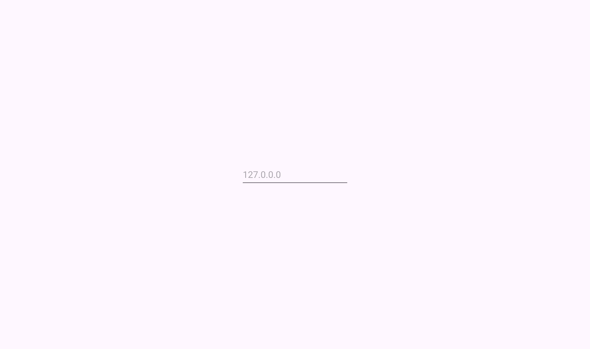
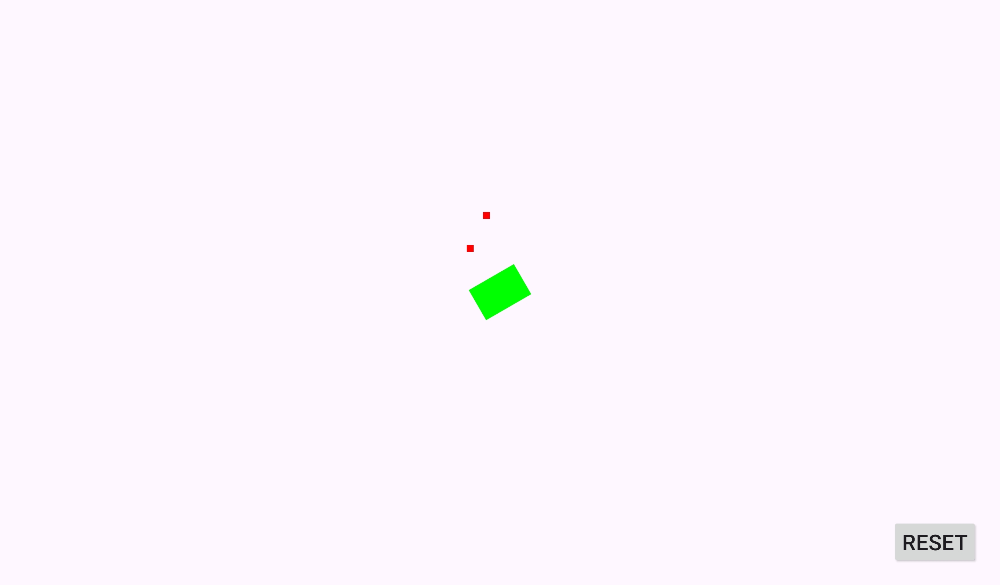

# Android app: **Map**

**Map** is connected to the MQTT server and receive all the messages related to the robot sensors. It dispays the robot position, the obstacles and the colors it has detected on the ground.

> [!TIP]
> This app was made using Android Studio. You can download the application from their [website](https://developer.android.com/studio)

## Features

- Connect to custom MQTT server
- Live previews of the robot and its environement
- Delete all the stored data and reset robot state
- See the connection state with the robot color

## Documentation

The app contains two activities: *Menu* and *Canvas*.
- The *Menu* activity is where you put the ip adress of the MQTT server. It then starts the second activity: *Canvas*.
- In the *Canvas* activity you only have two components, the canvas itself displaying the robot position, the environement, the colors from the ground, etc... and a reset button at the bottom right of the screen.

## Screenshots

  
Menu activity

  

  
Canvas activity

  

## 🛠️ Tech
- **Kotlin** v1.9.0
- **Gradle** v8.2
- [**Paho MQTT Android**](https://github.com/hannesa2/paho.mqtt.android)
